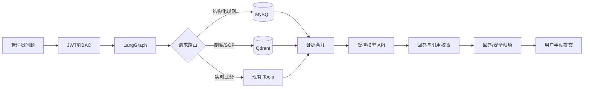
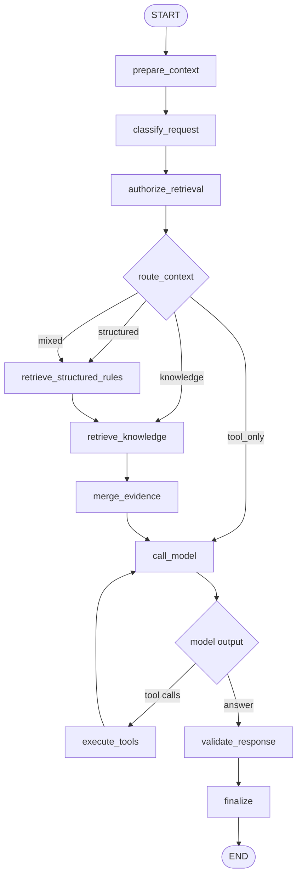

# LabOps Agent RAG 详细设计与实施方案

> 版本：v1.0｜日期：2026-09-02｜状态：待评审，尚未实施 RAG 代码  
> 适用系统：实验室管理系统｜第一阶段：采购申请、仪器预约

## 1. 目标、边界与当前基线

本文定义 LabOps Agent 的 RAG（Retrieval-Augmented Generation，检索增强生成）建设方案。目标不是给聊天框简单增加向量库，而是建立可检索、可授权、可引用、可评测、可降级的知识链路，并与现有 LangGraph、Django、MySQL 和 Tool Calling 组合。本文通过后才进入代码开发。

实施边界：

- 不改变现有采购申请、仪器预约业务语义；
- 不允许模型直接写数据库或拼 SQL；
- 采购和预约最终提交继续由用户手动点击；
- 第一阶段继续仅允许系统管理员使用助手；
- 前后端和现有 Docker 服务保持可用；
- 新增或修改的单个源码文件不超过 500 行；
- API Key、JWT、密码和 Guacamole 凭据不得进入模型或向量库。

当前基线：Django + JWT/RBAC、MySQL、`WhitelistItem` 采购白名单、`Equipment/Booking` 仪器预约模型、采购与仪器业务 Tools、安全预填、LangGraph 状态图、MySQL `conversation_id` 会话状态、Vue 常驻侧边栏，以及完整 Docker Compose 定义。

当前图为：

```text
prepare_context → call_model → [execute_tools → call_model] 或 finalize
```

`ProcurementContextService` 已包含默认返回空结果的 `ProcurementKnowledgeRetriever` 扩展点。RAG 将沿这个扩展点和新增图节点接入，不推倒现有业务实现。

## 2. 核心设计判断

### 2.1 RAG 不是训练模型

第一阶段不训练大模型，也不微调 Embedding 模型。实际链路是：

```text
资料 → 解析清洗 → 章节切分 → Embedding → 向量索引
问题 → 检索与重排 → 少量可靠证据 → 大模型回答/预填建议
```

只有固定评测集证明通用 Embedding 明显不足时，才讨论微调。

### 2.2 结构化事实和非结构化知识分开

- MySQL/业务 Service 是采购白名单、平台、经费类型、仪器 ID、通道状态、开放时间、个人记录和预约冲突的权威来源。
- RAG 负责制度、SOP、解释性规则、安全注意事项、操作指南和有效公告。
- 大模型负责理解问题、选择路线、调用工具和组织回答，不成为事实来源。

采购物品“属于哪个平台和经费类型”应优先命中 MySQL 白名单；“为什么这样选、填写时注意什么”才检索 RAG。这样避免把“向量最相似”误当成业务唯一正确。

### 2.3 Token 控制

- 先路由，不需要知识时不检索；
- 白名单只发送最相关的 1～3 条结构化候选；
- 文档初召回后重排，只发送 3～5 个 Chunk；
- 每个 Chunk 只保留回答所需章节；
- 同版本检索结果可短期缓存；
- 不发送完整文档、完整数据库记录或工具日志。

## 3. 第一阶段知识范围

### 3.1 采购

纳入：公共经费/公对公区别、平台选择、白名单规则、申请字段规范、耗材/药品/设备分类、与填写直接相关的发票验收流程、常见问题和有效公告。

不纳入：用户采购记录向量化、审批私人备注、未确认聊天内容、账号密码、令牌和支付凭据。

### 3.2 仪器

纳入：通用预约规则、仪器别名、通道与工位、时间粒度、XRD/电化学工作站/球磨机特殊规则、冷却时间、开放时间、提前预约限制、预约相关 SOP、安全事项、常见问题和停用公告。

不纳入：用户预约记录、实时通道占用、实时可预约时段和远程主机凭据；这些继续走业务 Tools。

### 3.3 文档登记要求

每份文档登记：标题、领域、来源类型、原始位置、版本、生效/失效时间、更新时间、可见范围、责任人、SHA-256、解析器版本、Embedding 版本和索引状态。文件哈希用于幂等更新，不能仅凭文件名判断版本。

## 4. 总体架构与权威顺序



事实权威顺序：

1. 登录身份和后端权限；
2. MySQL 实时业务数据及原业务 Service；
3. 已发布、在有效期内的结构化规则；
4. 经过权限、版本和阈值过滤的文档证据；
5. 大模型生成的自然语言表达。

来源冲突时禁止模型自行选择：实时配置优先于旧文档；同级文档取更新且已发布版本；仍冲突则明确提示管理员维护知识源。

## 5. 技术选型与决策门

### 5.1 Qdrant

推荐用独立 Qdrant Docker 容器，不替换 MySQL。它支持 Dense/Sparse 混合检索、RRF 等融合、多阶段检索和 Payload 过滤，适合按领域、权限和文档版本过滤。

官方参考：

- 混合与多阶段检索：https://qdrant.tech/documentation/search/hybrid-queries/
- Payload 过滤：https://qdrant.tech/documentation/search/filtering/
- Docker 与混合检索示例：https://qdrant.tech/documentation/tutorials-develop/hybrid-search-fastembed/

### 5.2 Embedding

按以下顺序决策：

1. 仅用无敏感短文本测试当前模型网关是否提供 `/v1/embeddings`；
2. 若支持，测试中文召回、延迟、费用和数据合规；
3. 若不支持或不适合，测试本地 BGE-M3；
4. 若主机资源不足，再评测较小中文模型。

BGE-M3 支持 Dense、Sparse 和多向量表示，官方模型卡标注 1024 维及较长输入能力，但最终是否采用取决于本机资源和本项目评测：https://huggingface.co/BAAI/bge-m3

### 5.3 Rerank

Rerank 做成可选层：资源允许时测试本地 BGE Reranker；资源不足先用混合检索 + RRF + 严格阈值；Reranker 异常自动回退融合排序。是否长期启用由引用正确率和 P95 延迟决定。

### 5.4 LangGraph

沿用现有 `StateGraph` 和有界工具循环，增加明确的分类、权限、检索、证据合并和引用校验节点，不引入无限循环。官方 Graph API：https://docs.langchain.com/oss/python/langgraph/graph-api

## 6. MySQL 元数据模型

### 6.1 KnowledgeDocument

| 字段 | 类型 | 说明 |
| --- | --- | --- |
| id | BigAutoField | 文档 ID |
| title/domain | CharField | 标题及 procurement/equipment |
| source_type/path/url | CharField | 类型、受控位置、可点击入口 |
| visibility/group_id | 字符/外键 | admin/group/public 及课题组 |
| version/checksum | CharField | 业务版本、SHA-256 |
| effective_at/expires_at | DateTime | 生效与失效时间 |
| status | CharField | draft/indexing/published/failed/archived |
| parser_version | CharField | 解析规则版本 |
| embedding_version | CharField | 模型及参数版本 |
| created_by/created_at/updated_at | 外键/时间 | 审计字段 |

### 6.2 KnowledgeChunk

| 字段 | 类型 | 说明 |
| --- | --- | --- |
| id/document/chunk_index | 主键/外键/整数 | 唯一定位 |
| section_path | CharField | 标题层级 |
| content/content_hash | Text/Char | 清洗原文及哈希 |
| char_count/token_estimate | Integer | 上下文预算 |
| page_start/page_end | Integer | PDF 页码，可空 |
| vector_point_id | UUID | Qdrant Point ID |
| is_active | Boolean | 是否检索 |

MySQL 保存可审计原文和元数据；Qdrant 保存向量及最少必要 Payload。

### 6.3 任务与日志

- `KnowledgeIngestionJob`：文档、版本、状态、开始/结束、Chunk 数、错误摘要、重试和操作者。
- `KnowledgeRetrievalLog`：请求 ID、脱敏用户、路由、耗时、候选/最终 Chunk ID、模型版本和失败类型；默认不存完整问题。
- `KnowledgeFeedback`：请求 ID、是否有帮助、问题类别和管理员备注，不保存思维链。

## 7. Qdrant Collection 设计

Collection 暂定 `labops_knowledge_v1`，Point 示例：

```json
{
  "id": "stable-uuid",
  "vector": {"dense": "...", "sparse": "..."},
  "payload": {
    "chunk_id": 1001,
    "document_id": 88,
    "domain": "procurement",
    "visibility": "admin",
    "group_id": null,
    "version": "2026-09",
    "status": "published",
    "effective_at": "2026-09-01T00:00:00+08:00",
    "expires_at": null,
    "content_hash": "sha256"
  }
}
```

要求：

- 为 `domain/visibility/group_id/status/version` 建 Payload Index；
- Point ID 由 `document_id + content_hash + embedding_version` 稳定生成；
- MySQL 文档归档后，旧 Point 立即被过滤但不急于物理删除；
- 返回结果后再用 MySQL 复核权限、状态和有效期，避免索引短暂不一致。

## 8. 文档导入与 Chunking

第一版先提供管理员命令，不制作上传页面：

```text
python manage.py ingest_labops_knowledge --path <受控文件> \
  --domain procurement --visibility admin --document-version 2026-09 --dry-run
```

导入链路：校验扩展名/MIME/大小/权限 → SHA-256 → 重复与版本检查 → 解析文本/标题/表格/页码 → 清洗 → 结构化切分 → Dense/Sparse 编码 → 写入临时索引版本 → 抽样一致性检查 → 原子发布 → 记录任务。失败不能留下“数据库成功、向量不完整”的半成品。

通用 Chunking 基线：

- 先按标题层级，再切超长章节；
- 初始目标 400～700 中文字符，重叠 60～100 字；
- 标题路径进入每个 Chunk；
- 列表、警告、操作步骤和表格尽量不拆散；
- 每个 Chunk 能反查页码、工作表或章节；
- 文档中的命令只作为资料，不成为系统指令。

格式规则：

- PDF：保留页码，去重复页眉页脚；扫描件 OCR 低置信内容标记待复核。
- DOCX/Markdown/HTML：保留标题、列表、表格、警告块和链接，删除导航/脚本/样式。
- XLSX：按工作表和逻辑表格处理，表头附加到每行；白名单优先同步结构化表，不能靠向量结果决定平台。

更新策略：checksum 未变则跳过；文档变更只重建受影响 Chunk；Embedding 模型改变时建立新 Collection 或新向量名，验证后切换，禁止混用不同维度。

## 9. 检索算法与上下文预算

```text
question → normalize → classify → permission_filter
→ structured_lookup（按需）
→ dense + sparse（按需）
→ RRF → rerank（可选）
→ authority/version/threshold 校验
→ evidence_budget → merge_context
```

初始参数仅作评测基线：

| 参数 | 初始值 |
| --- | --- |
| Dense Top-K | 20 |
| Sparse Top-K | 20 |
| RRF 合并上限 | 20 |
| Rerank 候选 | 8 |
| 最终证据 | 3～5 |
| 单 Chunk 注入 | 最多约 700 中文字符 |
| RAG 总注入 | 初始最多约 3,000 中文字符 |

阈值必须根据评测集确定。低于阈值时返回“未检索到可靠依据”，不能为了回答而降低阈值。缓存 Key 至少包含规范化问题、权限范围、领域、Collection/Embedding 版本；文档发布或归档时失效。

## 10. LangGraph 改造



新增 State 字段：`intent`、`needs_structured_context`、`needs_knowledge`、`permission_scope`、`structured_facts`、`retrieval_query`、`retrieved_chunks`、`evidence`、`retrieval_status`、`citation_errors`、`context_budget`。

节点职责：

- `classify_request`：规则优先、模型兜底，判断 structured/knowledge/tool/mixed。
- `authorize_retrieval`：只从认证用户生成范围，不接受模型提供身份字段。
- `retrieve_structured_rules`：调用现有白名单和仪器 Service。
- `retrieve_knowledge`：Qdrant 过滤、召回、融合、重排，再经 MySQL 复核。
- `merge_evidence`：结构化事实和文档证据分区，执行字符/Token 预算。
- `validate_response`：检查引用 ID、文档权限、工具结果与回答是否矛盾。
- `finalize`：只输出用户可见事实、引用和动作卡片。

RAG 异常进入降级分支，不能使采购状态和预约查询一并失效。

## 11. 业务组合与输出

### 11.1 采购预填

用户说“买两个 20mL 玻璃瓶，每个 80 元”：MySQL 匹配白名单 → 得到平台/经费/类别候选 → RAG 补充填写规范 → 模型调用 `prepare_procurement_request` → 后端再次校验 → 返回采购页面预填动作和依据 → 用户手动提交。

### 11.2 仪器预填

用户说“明早 8 点预约三号输力强两小时，需要注意什么”：MySQL 解析仪器与通道 → Tool 检查日期/粒度/冲突 → RAG 检索预约注意事项 → 合并实时结果和文档证据 → 返回预填与引用 → 用户手动提交。

### 11.3 无可靠依据

不使用常识补全危险实验参数；说明没有可靠依据和已检查范围；建议联系仪器负责人；不得生成预约以外的危险操作步骤。

API 保持 `POST /api/labops-agent/query/` 兼容，新增可选字段：

```json
{
  "answer": "……",
  "domain": "procurement",
  "conversation_id": "uuid",
  "request_id": "agt_xxx",
  "tools": [],
  "actions": [],
  "evidence": [{
    "document_id": 88,
    "chunk_id": 1001,
    "title": "公共采购管理办法",
    "section": "采购平台选择",
    "updated_at": "2026-09-01T10:00:00+08:00",
    "source_url": "/api/labops-agent/knowledge/documents/88/"
  }],
  "retrieval": {"route": "structured_and_rag", "status": "success", "evidence_count": 3}
}
```

前端第一阶段只增加“查看依据”、文档/章节/更新时间、受权限控制的原文入口，以及检索失败/证据不足/文档过期提示。不展示思维链、Prompt、向量值、未脱敏参数或内部过滤条件。

## 12. 权限、安全与 Prompt Injection

```text
JWT → IsSystemAdmin → permission_scope → Qdrant Payload Filter
→ MySQL 文档状态/范围复核 → 允许返回的 Chunk
```

安全要求：

- 检索过滤仅由服务端生成；不接受模型提交 `user_id/role/group_id`；
- 文档内容放在明确“引用资料”边界，并声明不能覆盖系统规则；
- 导入时标记“忽略前文、泄露密钥、调用工具”等可疑指令；
- 原文下载接口再次执行 RBAC；
- 向量库不保存密码、令牌、个人业务记录；
- 日志不记录完整 JWT、API Key 或敏感 URL 参数；
- Tool 参数继续由 DRF Serializer 白名单校验；
- 文档证据只能解释或辅助填充，写操作继续需要人工确认。

## 13. Docker、配置与故障降级

计划新增服务，评测前不固定版本、不实际启动：

```yaml
qdrant:
  image: qdrant/qdrant:<评测后固定版本>
  restart: unless-stopped
  volumes: [qdrant_data:/qdrant/storage]
  expose: ["6333"]
  healthcheck:
    test: ["CMD", "wget", "-qO-", "http://127.0.0.1:6333/healthz"]
    interval: 10s
    timeout: 5s
    retries: 20
```

要求：不向校园网映射 6333；仅后端网络访问；固定镜像版本；使用命名卷；限制 CPU/内存/日志；加入备份恢复；验证不影响 MySQL、Guacamole 和前后端。

计划配置：

```text
LABOPS_RAG_ENABLED=False
LABOPS_QDRANT_URL=http://qdrant:6333
LABOPS_QDRANT_COLLECTION=labops_knowledge_v1
LABOPS_EMBEDDING_PROVIDER=local_or_api
LABOPS_EMBEDDING_MODEL=<评测后确定>
LABOPS_RERANK_ENABLED=False
LABOPS_RAG_DENSE_TOP_K=20
LABOPS_RAG_SPARSE_TOP_K=20
LABOPS_RAG_FINAL_TOP_K=4
LABOPS_RAG_TIMEOUT_SECONDS=5
```

真实密钥仅进后端 `.env`，示例文件只写占位符。

| 故障 | 降级行为 |
| --- | --- |
| Qdrant 不可用 | 继续业务 Tools，知识回答说明不可用 |
| Embedding 超时 | 不让模型猜文档内容 |
| Reranker 失败 | 回退 RRF |
| 无超过阈值证据 | 明确依据不足 |
| 文档过期 | 不检索并告警 |
| MySQL/Qdrant 不一致 | 丢弃 Chunk 并记录错误 |
| 模型 API 失败 | 沿用统一 503 |
| 权限失败 | 403，不返回标题摘要 |

关闭 `LABOPS_RAG_ENABLED` 后，原采购/预约页面、Tools、LangGraph 和安全预填必须完全可用。

## 14. 日志、评测与测试

每次检索记录 request/conversation ID、脱敏 actor、路由、各阶段耗时、候选/最终 Chunk ID、版本、Token、降级原因、引用校验和反馈；不记录隐藏推理。

固定脱敏评测集：20 条白名单/平台匹配、15 条采购制度、20 条仪器规则、15 条 Tool+RAG、10 条多轮修改、10 条无答案、10 条权限/Prompt Injection、10 条组件故障。

指标：Recall@5、MRR/nDCG、引用正确率/完整率、Tool 选择及参数准确率、结构化字段准确率、端到端成功率、越权泄露次数、无依据拒答率、P50/P95、平均输入 Token、降级成功率。所有百分比必须实测，不能预先编造。

测试层级：

- 单元：解析、Chunk、权限、Payload、RRF、阈值、引用和 Prompt 边界；
- 集成：MySQL/Qdrant 一致性、幂等导入、版本切换、过期过滤、Embedding 超时；
- Agent：路由、混合问题、多轮修改、无证据拒答、引用校验、最大轮次；
- E2E：采购/仪器预填、引用抽屉、管理员权限、清空会话、前端降级；
- 写操作检查：测试前后对比业务表计数，确保不创建真实采购和预约。

## 15. 代码结构与实施阶段

```text
DjangoProject/labops_agent/
├── rag/
│   ├── config.py / schemas.py / permissions.py
│   ├── ingestion.py / chunking.py / embeddings.py
│   ├── vector_store.py / retrieval.py / reranker.py / citations.py
├── management/commands/
│   ├── ingest_labops_knowledge.py
│   ├── rebuild_labops_index.py
│   └── check_labops_index.py
├── tests/
│   ├── test_rag_ingestion.py / test_rag_retrieval.py
│   ├── test_rag_permissions.py / test_rag_graph.py
└── migrations/
```

每个文件单一职责且不超过 500 行。

实施顺序：

1. 阶段 0——收集资料、标记版本/权限/责任人；只读测试 Embedding；检查 CPU/内存/GPU/磁盘；先建评测集。
2. 阶段 1——知识模型与迁移；Qdrant Compose；解析与 `--dry-run`；幂等索引、版本切换、一致性检查、备份恢复。
3. 阶段 2——结构化检索、Dense/Sparse、RRF、可选 Rerank、权限/版本过滤、引用、缓存与降级。
4. 阶段 3——接入 LangGraph；保留原工具注册表、业务 Service、`LABOPS_AGENT_USE_LANGGRAPH` 和独立 RAG 开关。
5. 阶段 4——前端引用展示；完整评测；比较 Token/准确率/延迟；仅管理员灰度。

## 16. 发布、回退、备份与验收

发布：备份 MySQL/配置 → 启动独立 Qdrant → 健康检查 → Django 迁移 → `--dry-run` → 建索引但保持 RAG 关闭 → 评测/一致性检查 → 管理员灰度 → 观察后启用。

回退：先关闭 `LABOPS_RAG_ENABLED`，保留数据以便诊断；原 LangGraph、Tools、采购预填和仪器预填立即恢复为无 RAG 路线，不删除原业务数据。

备份：MySQL 知识元数据/Chunk、受控原文、Qdrant Snapshot 或卷、Collection Schema、模型/解析器/Chunk 版本和无真实密钥的环境模板。恢复后抽样核对 MySQL Chunk ID、Qdrant Point ID、文档版本和原文入口。

验收清单：

- 能导入、更新、归档采购和仪器文档；
- 能区分结构化规则、RAG、实时 Tools；
- 回答展示文档、章节、更新时间和原文入口；
- 证据不足不编造，组件故障可降级；
- 非管理员无法访问，不跨用户/范围泄露；
- Prompt Injection 不能改变工具权限；
- 向量库无密码、令牌和个人业务记录；
- 采购与预约仍由用户最终提交；
- 后端测试、前端构建、迁移检查通过；
- 文件均低于 500 行，备份恢复验证通过；
- 指标全部来自实际评测。

## 17. 实施前决策与下一步

进入代码前用测试结果确定：当前网关 Embedding 能力、本地 BGE-M3 资源消耗、首批正式文档及责任人、原文入口方式、未来是否扩展课题组范围、是否启用 Reranker、Qdrant 固定版本，以及最终 Chunk/Top-K/阈值/预算。

文档通过后的下一步是“阶段 0”，不直接启动 Qdrant：

1. 只读测试当前网关 `/v1/embeddings`；
2. 统计主机资源；
3. 盘点首批资料，但不把敏感原文发送给外部服务；
4. 建立 20～30 条最小评测集和标准证据；
5. 用结果决定 Embedding、Qdrant 版本和第一版参数；
6. 提交阶段 1 的精确代码、迁移和 Docker 改动清单供审核。

这个顺序避免先安装整套组件，最后才发现接口不支持、资源不足或资料本身无法形成可靠证据。
